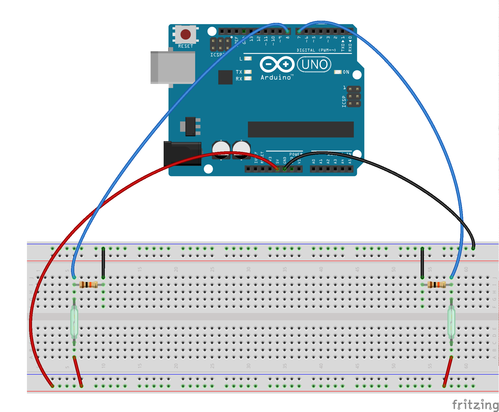
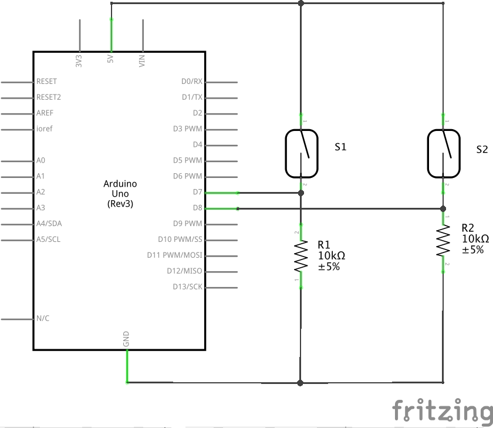

# Intelliroads

This lab demonstrates the use of reed switches wired to the Arduino board, in this case to calculate the speed of the magnet and make a POST to a RESTful API. The reed switches are separated by a known distance, which combined with the closing time of each switch, is used by Arduino to calculate the speed of the magnet. Finally, the Arduino makes a POST with the payload containing the speed value.

## Hardware

- Arduino Board
- WiFi Shield
- (2) Reed switch (form A)
- (2) 10K ohm resistor
- Magnet

## Circuit

Two reed switches connected to pins 2 and 3, through 10k ohm pull-down resistors.

## Schematic

